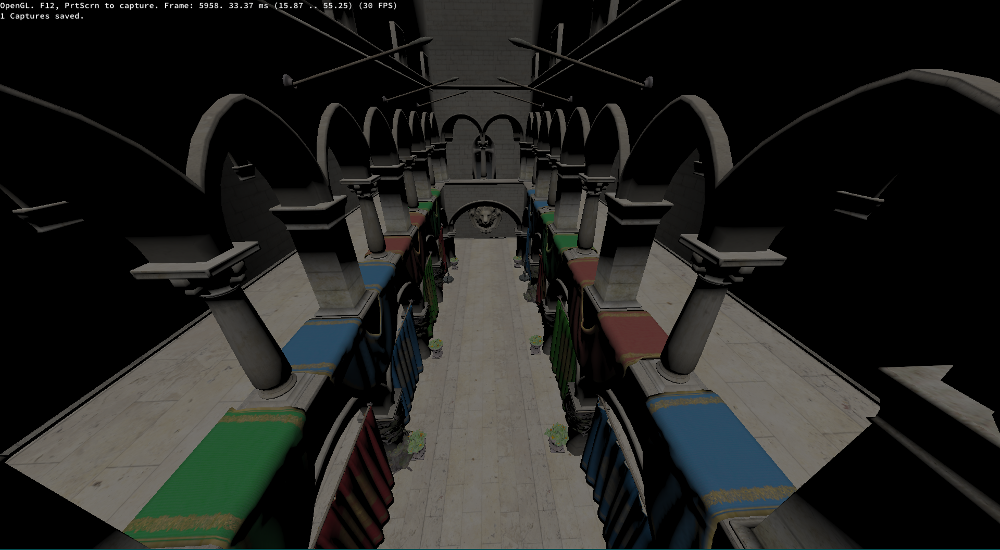

Resources used:

* https://registry.khronos.org/OpenGL/specs/gl/glspec46.core.pdf
* https://www.youtube.com/playlist?list=PLlrATfBNZ98foTJPJ_Ev03o2oq3-GGOS2
* https://learnopengl.com/

* https://www.gingerbill.org/series/memory-allocation-strategies/

Progress so far:
* Loading and hot-reloading of shaders
* Loading of .obj-models and its textures via assimp
* Blinn-Phong

Missing:
* A lot, e.g shadow mapping.

